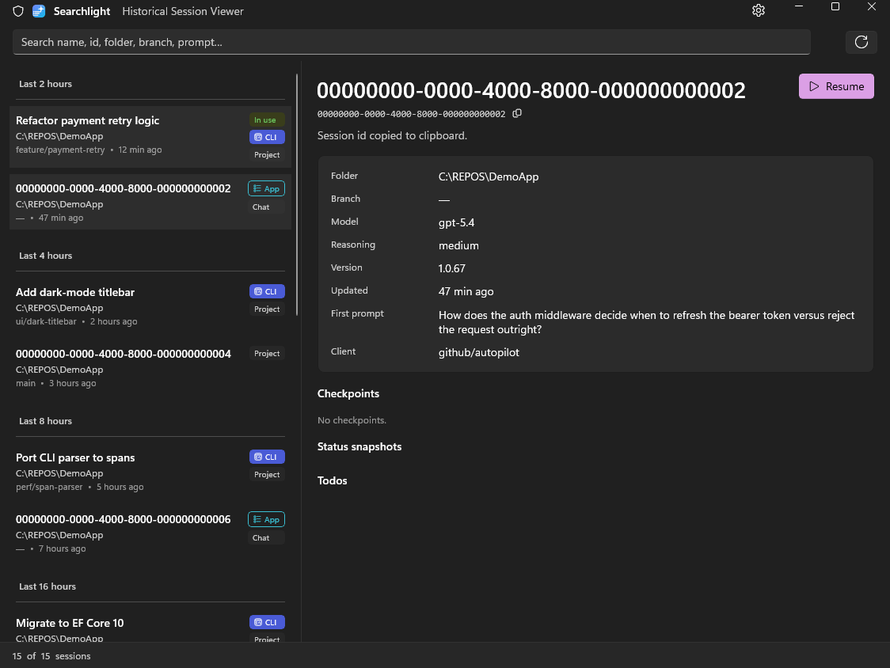

# Searchlight

**Searchlight: Historical Session Viewer** — a modern **.NET 10 / WinUI 3** Windows app that
shows a read-only GUI of your recent AI coding-agent sessions and lets you resume any of them
with one click.

Today it reads **GitHub Copilot** sessions from `~/.copilot/`. The data layer is agent-neutral
by design — support for other agents (e.g. Claude Code) is a planned extension.

> **This fork** adds both halves of that extension: a **Claude Code** data source reading
> `~/.claude/projects/`, and a cross-platform **Avalonia** host so the GUI runs on Windows,
> macOS, and Linux. The Avalonia host supports **both agents** — Copilot and Claude Code — in
> one combined session list, resuming each session with the CLI that owns it. See
> [Cross-platform](#cross-platform-copilot--claude-code-avalonia-host) below.

> **Status:** feature-complete and running. A WinUI host + a cross-platform Avalonia host + a
> platform-neutral Core library + an xUnit test project (99 tests green).

## Screenshot



_Captured using the `Demo` build config (synthetic data) so no proprietary session content is shown._

## What it does

- **Frequency-sorted session list** with recency group headers (Last 2h / 4h / 8h / 16h / 32h,
  then grouped by day).
- **Details pane** — model, reasoning effort, first-prompt preview, checkpoints, status snapshots,
  client type (CLI vs App), and more.
- **One-click Resume** — hands off to `copilot --resume=<id>` in Windows Terminal.
- **System tray** — lives in the tray like ScriptTray; hides on close, exits from the tray menu.
- **Read-only by design** — never writes to `~/.copilot`.

## Quick start

```powershell
# Build the whole solution
dotnet build Searchlight.slnx -c Debug

# Run the unit tests (platform-neutral, no WinUI needed)
dotnet test src/Searchlight.Core.Tests/Searchlight.Core.Tests.csproj

# Run against your real sessions
dotnet run --project src/Searchlight -c Debug

# Run against synthetic data (safe for screenshots)
dotnet run --project src/Searchlight -c Demo
```

Requires the **.NET 10 SDK** (pinned via `global.json`) on Windows.

## Run modes

| Mode | How | Data source |
|------|-----|-------------|
| Tray (default) | `dotnet run --project src/Searchlight` | Live `~/.copilot` |
| No tray | append `--no-tray` | Live `~/.copilot` |
| Demo / mock | `Demo` build config, or `--demo` flag | Synthetic (15 sessions) |

## Install & launch (no dev tools needed)

To run Searchlight without `dotnet run` — from the Start Menu, a desktop icon, or automatically at
login — use the installer script. It publishes a **self-contained** build (no .NET runtime required
on the target) to `%LOCALAPPDATA%\Searchlight\app` and creates shortcuts:

```powershell
# Install: publish + Start Menu + desktop + run-at-login shortcuts
pwsh -File tools/install.ps1

# Uninstall: remove all shortcuts and the install folder
pwsh -File tools/install.ps1 -Action Uninstall
```

After installing:

- **Launch on demand** — press the **Win** key and type `Searchlight`, or use the desktop icon.
- **At login** — it starts automatically and sits in the system tray (a **Startup** shortcut is
  created).
- **Single instance** — launching again (e.g. clicking the icon while it's already running at
  login) just surfaces the existing window instead of adding a second tray icon.

Installer switches:

| Switch | Effect |
|--------|--------|
| `-NoDesktop` | Skip the desktop shortcut |
| `-NoStartup` | Skip the run-at-login (Startup) shortcut |
| `-SkipPublish` | Reuse the last published output (faster re-install) |
| `-Configuration Debug` | Publish a Debug build instead of Release |

## Cross-platform: Copilot + Claude Code (Avalonia host)

`src/Searchlight.Avalonia` is a cross-platform front-end (Windows / macOS / Linux) over the
same Core library, backed by **either or both** session stores:

- **Auto-detect** — with no flags, the host shows whichever stores exist on disk; when both
  `~/.claude/projects/` and `~/.copilot/session-state/` are present, the session lists are
  merged into one view (each row's client badge shows Claude / CLI / App).
- **Claude Code source** — reads the per-project `sessions-index.json` for the cheap bulk list
  (summary, first prompt, message count, branch, timestamps), merged with any un-indexed
  `<uuid>.jsonl` transcripts on disk. Transcript head-parsing (model, CLI version) is deferred
  until a row is selected, mirroring the Copilot source.
- **One-click Resume** — routed to the CLI that owns the session:
  `cd <workspace> && claude --resume <id>` for Claude Code, `copilot --resume=<id>` for
  Copilot — in Terminal.app on macOS, `x-terminal-emulator` on Linux, a new `cmd` window on
  Windows.
- **Read-only by design** — never writes to `~/.claude` or `~/.copilot`.
- **Tray + single instance** — like the WinUI host: minimize/close hide to the
  tray (menu-bar icon on macOS), the tray menu shows/exits, and launching a
  second copy surfaces the running window instead. Opt out with `--no-tray`.
  On Linux, close/minimize keep their normal meaning (not every desktop has a
  tray host to restore from); the tray icon still appears where one exists.

```bash
# Run the unit tests (any OS)
dotnet test src/Searchlight.Core.Tests/Searchlight.Core.Tests.csproj

# Run against your real sessions (auto-detects Claude Code and/or Copilot)
dotnet run --project src/Searchlight.Avalonia

# Force a single store
dotnet run --project src/Searchlight.Avalonia -- --source=claude
dotnet run --project src/Searchlight.Avalonia -- --source=copilot

# Run against synthetic data
dotnet run --project src/Searchlight.Avalonia -- --demo
```

Building `Searchlight.slnx` as a whole still requires Windows (the WinUI host); on macOS/Linux
build the individual projects above.

To install without dev tools on macOS/Linux — the counterpart of `tools/install.ps1`:

```bash
# Install: self-contained publish + app launcher + run-at-login
tools/install.sh

# Uninstall, skip run-at-login, or reuse the last publish
tools/install.sh --uninstall
tools/install.sh --no-startup
tools/install.sh --skip-publish
```

## Documentation

Full knowledge base in [`docs/`](./docs/README.md):

- [architecture.md](./docs/architecture.md) — layered architecture, DI composition root, data flow
- [engineering.md](./docs/engineering.md) — build configs, compile flags, run modes, commands
- [data-model.md](./docs/data-model.md) — `~/.copilot` sources and the in-memory domain model

## License

[MIT](./LICENSE)
