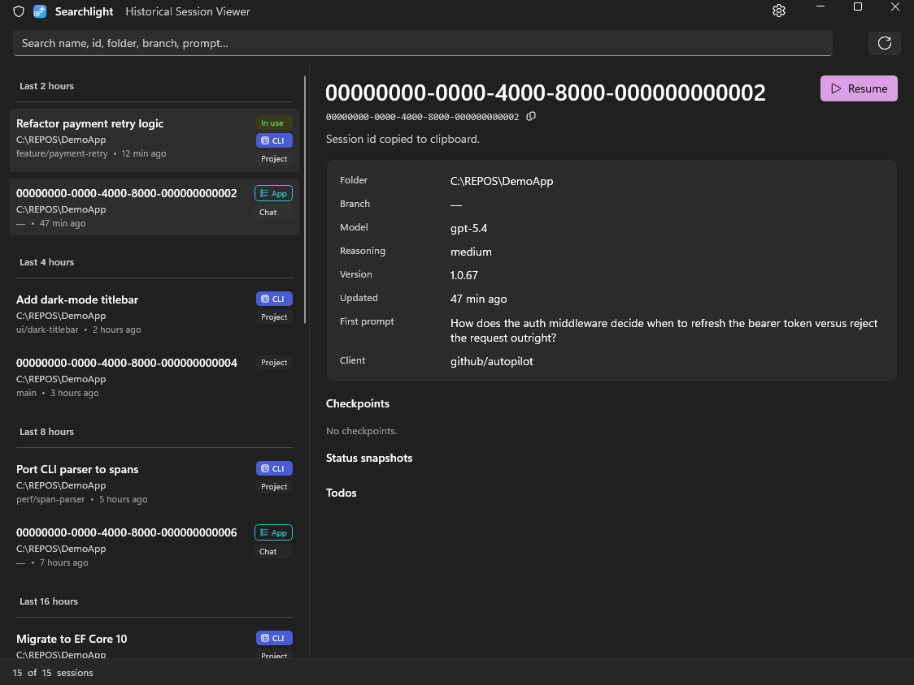

# Searchlight

**Searchlight: Historical Session Viewer** — a modern **.NET 10 / WinUI 3** Windows app that
shows a read-only GUI of your recent AI coding-agent sessions and lets you resume any of them
with one click.

Today it reads **GitHub Copilot** sessions from `~/.copilot/`. The data layer is agent-neutral
by design — support for other agents (e.g. Claude Code) is a planned extension.

> **Status:** feature-complete and running. A WinUI host + a platform-neutral Core library + an
> xUnit test project (36 tests green).

## Screenshot



_Captured using the `Demo` build config (synthetic data) so no proprietary session content is shown._

## What it does

- **Frequency-sorted session list** with recency group headers (Last 2h / 4h / 8h / 16h / 32h,
  then grouped by day).
- **Details pane** — model, reasoning effort, first-prompt preview, checkpoints, status snapshots,
  client type (CLI vs App), and more.
- **One-click Resume** — hands off to `copilot --resume=<id>` in Windows Terminal.
- **System tray** — lives in the tray like ScriptTray; hides on close, exits from the tray menu.
- **Read-only by design** — never writes to `~/.copilot`.

## Quick start

```powershell
# Build the whole solution
dotnet build Searchlight.slnx -c Debug

# Run the unit tests (platform-neutral, no WinUI needed)
dotnet test src/Searchlight.Core.Tests/Searchlight.Core.Tests.csproj

# Run against your real sessions
dotnet run --project src/Searchlight -c Debug

# Run against synthetic data (safe for screenshots)
dotnet run --project src/Searchlight -c Demo
```

Requires the **.NET 10 SDK** (pinned via `global.json`) on Windows.

## Run modes

| Mode | How | Data source |
|------|-----|-------------|
| Tray (default) | `dotnet run --project src/Searchlight` | Live `~/.copilot` |
| No tray | append `--no-tray` | Live `~/.copilot` |
| Demo / mock | `Demo` build config, or `--demo` flag | Synthetic (15 sessions) |

## MSIX distribution and local review

Build and sideload **Searchlight Dev** alongside the production package. The channels
have separate app identities and share settings and notes in `%USERPROFILE%\.searchlight`.
See [MSIX builds and signing](docs/msix.md) for certificate setup and the complete workflow.

```powershell
$build = .\tools\Build-Msix.ps1 -CertificateThumbprint '<your-development-certificate-thumbprint>'
.\tools\Install-DevMsix.ps1 -Path $build.Path
```

## Unpackaged install & launch

To run Searchlight without `dotnet run` — from the Start Menu, a desktop icon, or automatically at
login — use the installer script. It publishes a **self-contained** build (no .NET runtime required
on the target) to `%LOCALAPPDATA%\Searchlight\app` and creates shortcuts:

```powershell
# Install: publish + Start Menu + desktop + run-at-login shortcuts
pwsh -File tools/install.ps1

# Uninstall: remove all shortcuts and the install folder
pwsh -File tools/install.ps1 -Action Uninstall
```

After installing:

- **Launch on demand** — press the **Win** key and type `Searchlight`, or use the desktop icon.
- **At login** — it starts automatically and sits in the system tray (a **Startup** shortcut is
  created).
- **Single instance** — launching again (e.g. clicking the icon while it's already running at
  login) just surfaces the existing window instead of adding a second tray icon.

Installer switches:

| Switch | Effect |
|--------|--------|
| `-NoDesktop` | Skip the desktop shortcut |
| `-NoStartup` | Skip the run-at-login (Startup) shortcut |
| `-SkipPublish` | Reuse the last published output (faster re-install) |
| `-Configuration Debug` | Publish a Debug build instead of Release |

## Documentation

Full knowledge base in [`docs/`](./docs/README.md):

- [architecture.md](./docs/architecture.md) — layered architecture, DI composition root, data flow
- [engineering.md](./docs/engineering.md) — build configs, compile flags, run modes, commands
- [data-model.md](./docs/data-model.md) — `~/.copilot` sources and the in-memory domain model
- [msix.md](./docs/msix.md) — package identities, shared data, signing, and Dev sideloads

## License

[MIT](./LICENSE)
